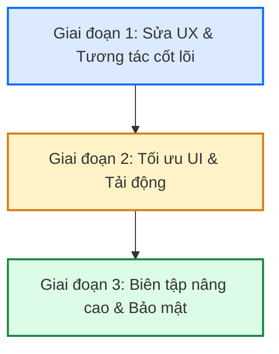

# 📊 KẾ HOẠCH PHÁT TRIỂN & TỐI ƯU HÓA TÍNH NĂNG TIN TỨC (STORIES)
> **Dự án**: CNM Social Network (CNM_Web)
> **Tài liệu**: Story Feature Audit & Implementation Roadmap

Tài liệu này đánh giá toàn diện trạng thái hiện tại của tính năng **Tin tức (Stories)** trong hệ thống Mạng xã hội, chỉ ra các chức năng đã hoàn thành, các khoảng trống trải nghiệm (UX Gaps) cần bổ sung, và đề xuất lộ trình triển khai chi tiết mà không làm ảnh hưởng đến mã nguồn hiện tại.

---

## I. TỔNG QUAN HỆ THỐNG STORIES HIỆN TẠI

Tính năng Stories hiện được phân tách thành các cấu phần chính sau:
1. **`types.ts`**: Định nghĩa cấu trúc `StoryResponse` (storyId, mediaType, mediaUrl, background, viewCount, isViewedByMe,...) và `StoryViewerResponse`.
2. **`api.ts`**: Khai báo đầy đủ các cổng giao tiếp API thực tế với Spring Boot backend bao gồm: tạo tin (`createStory`), tải tin tức đang chạy (`getStoryFeed`), đánh dấu đã xem (`viewStory`), thả cảm xúc (`reactToStory`), phản hồi tin nhắn (`replyToStory`), và lấy danh sách người xem (`getStoryViewers`).
3. **`SocialFeedMain.tsx`**: Carousel hiển thị danh sách vòng tròn Story của người dùng hiện tại và bạn bè ở đầu Bảng tin (Social Feed).
4. **`CreateStoryModal.tsx`**: Modal tạo tin mới hỗ trợ 3 định dạng: **Ảnh (IMAGE)**, **Video (VIDEO)**, hoặc **Chữ (TEXT)** với 5 phông nền gradient sang trọng.
5. **`StoryViewer.tsx`**: Trình chiếu tin toàn màn hình với thanh tiến trình chạy tự động 5 giây, hỗ trợ vuốt chạm (trái/phải) để chuyển tin, nhập tin nhắn trả lời và xem danh sách người xem.
6. **`SocialArchive.tsx`**: Tích hợp danh sách lưu trữ các Story đã hết hạn (sau 24h) vào kho Lưu trữ cá nhân của người dùng.

---

## II. DANH SÁCH CÁC CHỨC NĂNG ĐÃ HOÀN THÀNH (SUPPORTED)

Hệ thống hiện tại đã sở hữu nền tảng Stories rất vững chắc và kết nối API thật:

### 1. Phía Người dùng (Creator)
* **Đa dạng định dạng đăng:** Cho phép tải lên hình ảnh, video ngắn, hoặc viết chữ tự do với phông nền rực rỡ.
* **Thời gian hiển thị:** Tự động hết hạn và ẩn khỏi bảng tin sau 24 giờ.
* **Kho lưu trữ (Archive):** Các Story hết hạn tự động chuyển vào mục lưu trữ bảo mật để người dùng xem lại hoặc khôi phục.

### 2. Phía Người xem (Viewer)
* **Giao diện Stories Bar mượt mà:** Bảng trượt ngang ở đầu trang feed hiển thị vòng tròn phân biệt tin đã xem (viền xám) và tin chưa xem (viền gradient chuyển màu năng động).
* **Trình chiếu tự động (Auto-advance):** Chuyển tin tiếp theo sau 5 giây đối với ảnh/chữ kèm thanh tiến trình (progress bar) trực quan.
* **Tạm dừng thông minh:** Giữ chuột/ngón tay (onPointerDown) để đóng băng tạm thời tiến trình xem tin.
* **Tương tác trực tiếp:** Thả cảm xúc ❤️ nhanh, hoặc gửi tin nhắn phản hồi trực tiếp (tự động chuyển thành tin nhắn chat riêng tư).

### 3. Phía Thống kê (Analytics)
* **Đếm lượt xem:** Hiển thị tổng số người xem của từng Story.
* **Danh sách người xem chi tiết:** Drawer hiển thị tên, avatar, thời gian xem tin và loại cảm xúc của từng người xem thời gian thực.

---

## III. NHỮNG KHOẢNG TRỐNG TRẢI NGHIỆM & CHỨC NĂNG CÒN THIẾU (GAPS)

Để tính năng Stories đạt đẳng cấp **Premium (Instagram/Facebook level)**, có 8 thiếu sót quan trọng về cả UI/UX và logic cần khắc phục:

### 1. ⚠️ Lỗi tự động chuyển tiếp Video (Video Auto-Advance Bug)
* **Hiện trạng:** Đối với tin dạng Video, trình duyệt bật chế độ `loop` và hoàn toàn bỏ qua bộ đếm thời gian 5s. Tuy nhiên, thẻ `<video>` **chưa có thuộc tính `onEnded`** để tự động kích hoạt hàm `handleNext()`.
* **Hậu quả:** Khi video kết thúc, nó sẽ lặp lại vô tận. Người xem bị mắc kẹt tại tin đó trừ khi họ tự click chuyển tiếp thủ công.

### 2. 🧩 Phân khúc nét đứt trên Vòng tròn Carousel (Multiple Active Segments Ring)
* **Hiện trạng:** Dù một người đăng 1 tin hay 10 tin, vòng tròn đại diện của họ trên Stories Bar đầu Feed vẫn là một đường viền liền mạch duy nhất.
* **Đề xuất nâng cấp:** Chia viền tròn thành các đoạn nét đứt tương ứng với số lượng tin đang hoạt động (ví dụ: đăng 3 tin thì viền tròn chia thành 3 đoạn) để kích thích người xem click khám phá.

### 3. 🤩 Danh sách cảm xúc nhanh nghèo nàn (Quick Reactions Emojis Bar)
* **Hiện trạng:** Người xem chỉ có thể bấm nút Heart ❤️ đơn điệu.
* **Đề xuất nâng cấp:** Khi click vào khung phản hồi hoặc biểu tượng cảm xúc, hiển thị khay 6-8 Emojis phản ứng nhanh phổ biến (😂, 😮, 😢, 👏, 🔥, 🎉, ❤️, 💯) giống Instagram để tăng tính tương tác.

### 4. 🗑️ Thiếu tính năng Xóa tin nhanh từ Trình xem (Quick Delete Story)
* **Hiện trạng:** Nếu người dùng lỡ đăng nhầm một Story, họ không thể xóa nhanh khi đang mở trình xem tin của chính mình.
* **Hậu quả:** Người dùng phải vào kho lưu trữ hoặc hồ sơ rất phức tạp để xóa tin đang hoạt động.
* **Đề xuất nâng cấp:** Thêm nút ba chấm `...` hoặc icon thùng rác bên góc trên bên phải trình xem (chỉ hiển thị với chính chủ) để xóa tin ngay lập tức.

### 5. 🎨 Bộ công cụ biên tập Ảnh/Video nâng cao (Advanced Creative Editor Overlay)
* **Hiện trạng:** Khi chọn ảnh hoặc video để đăng, người dùng chỉ có thể đăng nguyên bản. Không thể chèn chữ, chèn nhãn dán (sticker), định vị vị trí (geotag), hay vẽ tay lên bề mặt phương tiện.
* **Đề xuất nâng cấp:** Bổ sung lớp phủ canvas cho phép người dùng nhấp để thêm chữ tùy chỉnh (chọn màu, kéo thả vị trí) ngay trên ảnh/video trước khi đăng.

### 6. ⏳ Chưa có công cụ giới hạn và cắt ngắn Video (Video Trimmer)
* **Hiện trạng:** Không có bộ kiểm soát độ dài video tải lên. Nếu người dùng tải lên video dài 5 phút, trình xem sẽ tải rất chậm và ảnh hưởng xấu đến UX.
* **Đề xuất nâng cấp:** Giới hạn video story tối đa là 15 hoặc 30 giây. Báo lỗi hoặc hiển thị thanh trượt cắt video (trimmer) đơn giản trước khi tải lên.

### 7. 🔒 Cài đặt quyền riêng tư linh hoạt (Story Privacy Selector)
* **Hiện trạng:** Tất cả tin tức mặc định chia sẻ Công khai (Public).
* **Đề xuất nâng cấp:** Thêm tùy chọn trước khi chia sẻ tin: *Công khai (Public)*, *Bạn bè (Friends)*, hoặc danh sách *Bạn thân (Close Friends)*.

### 8. 🎭 Hiệu ứng lật trang 3D giữa các tác giả (3D Cube Swipe Transition)
* **Hiện trạng:** Việc chuyển đổi từ tin cuối cùng của tác giả A sang tin đầu tiên của tác giả B diễn ra đột ngột bằng cách đổi ảnh tức thời.
* **Đề xuất nâng cấp:** Tích hợp thư viện vuốt chạm hỗ trợ hiệu ứng xoay hộp (3D Cube Effect) mang lại trải nghiệm thị giác ấn tượng và hiện đại.

---

## IV. LỘ TRÌNH TRIỂN KHAI CHI TIẾT (IMPLEMENTATION ROADMAP)

Để phát triển các tính năng trên một cách an toàn, hệ thống nên đi theo lộ trình 3 giai đoạn:

### 📅 Giai đoạn 1: Sửa lỗi UX cốt lõi & Tăng tốc tương tác nhanh (Phù hợp triển khai ngay)
* **Nhiệm vụ 1: Khắc phục Video Loop.** Thêm sự kiện `onEnded` cho thẻ `<video>` trong `StoryViewer.tsx` để tự động gọi `handleNext()`.
* **Nhiệm vụ 2: Thêm Khay cảm xúc nhanh.** Thay thế nút thả tim đơn bằng khay popover chứa các Emojis: 😂, 😮, 😢, 👏, 🔥, 🎉, ❤️, 💯.
* **Nhiệm vụ 3: Tích hợp Xóa tin nhanh.** Bổ sung nút xóa tại trình xem của chính chủ. Gọi API xóa và cập nhật lại state của Stories ngay lập tức mà không cần tải lại trang.

### 📅 Giai đoạn 2: Tối ưu hóa UI trực quan & Trải nghiệm chuyển trang
* **Nhiệm vụ 4: Phân chia nét đứt vòng tròn tin.** Trong `SocialFeedMain.tsx`, tính toán số lượng tin của tác giả và áp dụng thuộc tính `stroke-dasharray` hoặc tạo các thẻ `div` xoay quanh avatar để phân đoạn trực quan.
* **Nhiệm vụ 5: Loading Skeleton cho danh sách người xem.** Tạo hiệu ứng khung xương tải mượt mà trong Drawer người xem thay vì dùng chữ "Đang tải..." thô sơ.
* **Nhiệm vụ 6: Thao tác vuốt chạm trên thiết bị di động.** Tích hợp thư viện `react-swipeable` hoặc tính toán tọa độ TouchEvents để hỗ trợ vuốt lên để xem danh sách người xem, vuốt ngang để đổi tác giả.

### 📅 Giai đoạn 3: Công cụ sáng tạo & Quản lý nâng cao
* **Nhiệm vụ 7: Lớp phủ chữ viết (Text Overlay Editor).** Cho phép người dùng viết chữ lên ảnh/video khi tạo tin, lưu tọa độ X/Y và render text trên giao diện xem tin.
* **Nhiệm vụ 8: Tích hợp Lựa chọn quyền riêng tư.** Cho phép gửi kèm cấu hình bảo mật lên backend và lọc danh sách hiển thị tin tương ứng.

---
> [!NOTE]
> Tất cả các đề xuất trên đều được nghiên cứu kỹ lưỡng dựa trên cấu trúc backend Spring Boot hiện tại và hệ thống API sẵn có trong file `src/features/social/api.ts`. Giai đoạn 1 có thể được tiến hành dễ dàng bằng cách chỉnh sửa trực tiếp các component hiển thị mà không cần thay đổi cấu trúc dữ liệu cốt lõi.
