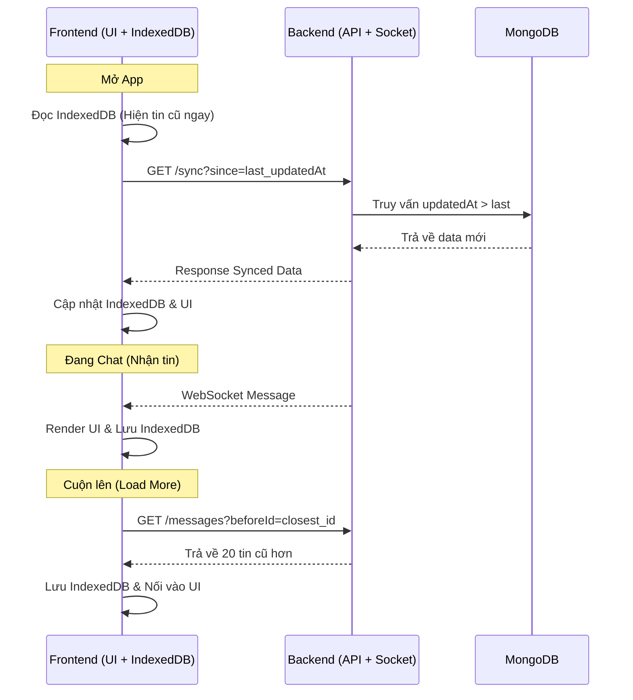

# Chiến lược Tối ưu hóa Luồng Tin nhắn (Fruvia App)

Tài liệu này mô tả chi tiết 3 giai đoạn để xây dựng hệ thống tin nhắn mượt mà, tiết kiệm tài nguyên và hỗ trợ làm việc ngoại tuyến (Offline-first).

---

## GIAI ĐOẠN 1: Tải tin nhắn thông minh (Pagination & Infinite Scroll) - [Đã hoàn thành ✅]

Thay vì tải hàng nghìn tin nhắn cùng lúc, ta chỉ tải từng "gói" nhỏ để tiết kiệm tài nguyên.

### 1.1 Chiến thuật Cursor-based Pagination (Phân trang theo con trỏ)
*   **Lần đầu vào Chat**: Frontend (FE) gửi yêu cầu lấy 20 tin nhắn mới nhất.
    *   *Tham số*: `conversationId`, `limit=20`.
*   **Khi người dùng cuộn lên (Scroll Up)**: FE lấy `id` hoặc `timestamp` của tin nhắn cũ nhất đang hiển thị làm "con trỏ" (Cursor).
    *   *Yêu cầu tiếp theo*: `GET /messages?conversationId=XYZ&limit=20&beforeId=ID_TIN_NHAN_CU_NHAT`.
*   **Backend (MongoDB)**: Thực hiện truy vấn:
    ```javascript
    db.messages.find({ 
      conversationId: XYZ, 
      _id: { $lt: beforeId } 
    }).sort({ _id: -1 }).limit(20);
    ```

### 1.2 Xử lý Giao diện (Infinite Scroll)
*   **Observer Pattern**: Sử dụng `react-intersection-observer` đặt ở đỉnh danh sách tin nhắn.
*   **Trigger**: Khi phần tử này xuất hiện (cuộn tới đỉnh), hàm lấy tin nhắn cũ tự động kích hoạt.
*   **Nối dữ liệu**: Tin nhắn cũ tải về được đẩy vào đầu mảng (State) mà không làm gián đoạn vị trí cuộn hiện tại.

---

## GIAI ĐOẠN 2: Lưu trữ tạm thời tại máy (Client-side Caching)

Mục đích: Mở App là thấy tin nhắn ngay, không chờ đợi (Zero-loading).

### 2.1 Sử dụng IndexedDB (Dexie.js)
*   **IndexedDB**: Database chạy trong trình duyệt, lưu trữ hàng GB dữ liệu bền vững.
*   **Cấu trúc bảng**: Bảng `messages` bao gồm: `_id, content, senderId, timestamp, updatedAt, status`.

### 2.2 Cơ chế Offline-First
1.  **Bước 1**: Khi mở Chat, FE truy vấn `IndexedDB` để lấy 20-50 tin nhắn gần nhất hiện lên ngay lập tức.
2.  **Bước 2**: Song song đó, gọi API Sync lên Server để kiểm tra cập nhật mới nhất.

---

## GIAI ĐOẠN 3: Đồng bộ dữ liệu (Sync Local & Server)

Đảm bảo dữ liệu máy cá nhân và MongoDB luôn khớp nhau.

### 3.1 Nguyên tắc "Source of Truth"
*   **MongoDB** là nguồn sự thật cuối cùng.
*   Mỗi tin nhắn bắt buộc có trường `updatedAt`.

### 3.2 Quy trình Synchronization
1.  **Kiểm tra mốc thời gian**: FE tìm tin nhắn có `updatedAt` mới nhất trong IndexedDB (ví dụ: `T1`).
2.  **Gửi tín hiệu Sync**: `GET /messages/sync?since=T1`.
3.  **Server phản hồi**: Trả về tất cả tin nhắn có `updatedAt > T1` (bao gồm tin nhắn mới, tin nhắn vừa sửa, hoặc tin nhắn bị đánh dấu xóa).
4.  **Ghi đè (Upsert)**: FE dùng `db.messages.bulkPut(data)` của Dexie để cập nhật Local.

### 3.3 Xử lý gửi tin mới (Optimistic UI)
*   **Gửi tin**: Thêm ngay vào IndexedDB với `status: 'sending'`.
*   **Gửi Socket/API**: Chờ phản hồi từ Server.
*   **Xác nhận**: Khi thành công, đổi `status: 'sent'` và cập nhật `_id` thật từ Server trả về.

---

## TỔNG KẾT LUỒNG DỮ LIỆU


